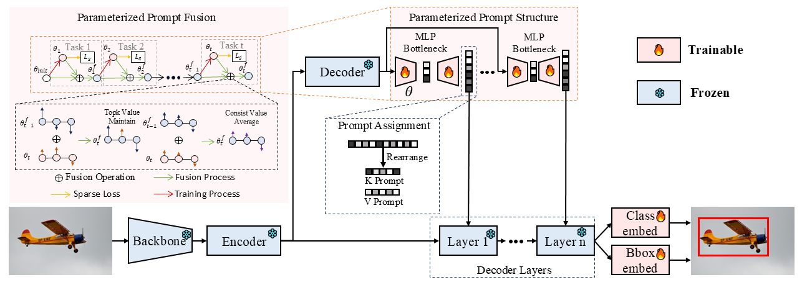

# Parameterized Prompt for Incremental Object Detection

[](https://arxiv.org/abs/2510.27316)

The official repository for [CVPR'26 paper](https://arxiv.org/abs/2510.27316) "Parameterized Prompt for Incremental Object Detection".

## Abstract
Recent studies have demonstrated that incorporating trainable prompts into pretrained models enables effective incremental learning. However, the application of prompts in incremental object detection (IOD) remains underexplored. Our study reveals that existing prompts-pool-based approaches assume disjoint class sets across incremental tasks, which are unsuitable for IOD as they overlook the inherent co-occurrence phenomenon in detection. In co-occurring scenarios, unlabeled objects from previous tasks may appear in current task images, leading to confusion in prompts pool. In this paper, we hold that prompt structures should exhibit adaptive consolidation properties across tasks, with constrained updates to prevent confusion and catastrophic forgetting. Motivated by this, we introduce Parameterized Prompts for Incremental Object Detection (P2IOD). Leveraging neural networks global evolution properties, P2IOD employs networks as the parameterized prompts to adaptively consolidate knowledge across tasks. To constrain prompts structure updates, P2IOD further engages a parameterized prompts fusion strategy.
<div align="center">

</div>

## Overview
We validate our proposed method on two different pretrained models: Deformable DETR pretrained on the MS COCO dataset and Co-DETR pretrained on the Objects365 dataset. Since the training frameworks of these two models differ, we implement our method separately in two distinct codebases. The instructions for running the two codebases can be found at [P2IOD-MSCOCO-pretrained/README.md](P2IOD-MSCOCO-pretrained/README.md) and [P2IOD-objects365-pretrained/README.md](P2IOD-objects365-pretrained/README.md), respectively.
## Acknowledgements
This work is partially supported by the Chinese Academy of Sciences Project for Young Scientists in Basic Research (YSBR-107)

## Citing this work
If you find the project helpful, please consider citing our paper:
```bibtex
@article{an2025parameterized,
  title={Parameterized Prompt for Incremental Object Detection},
  author={An, Zijia and Diao, Boyu and Liu, Ruiqi and Huang, Libo and Yang, Chuanguang and Wang, Fei and An, Zhulin and Xu, Yongjun},
  journal={arXiv preprint arXiv:2510.27316},
  year={2025}
}
```
